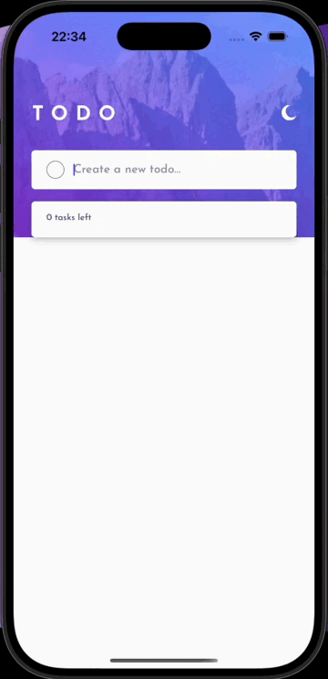
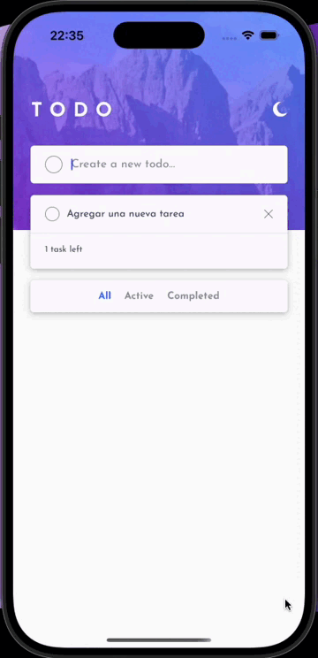
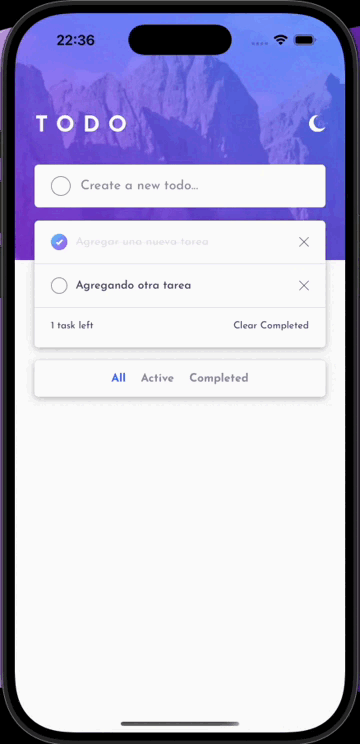
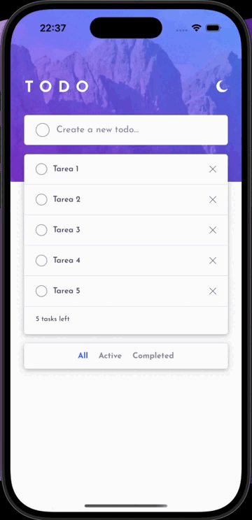
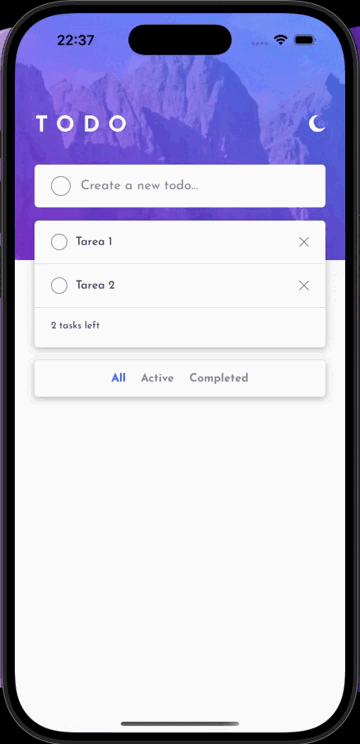
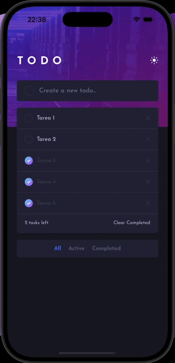

🧩 Todo App — Fullstack desde cero (Mobile + API)

Este proyecto es una implementación **fullstack** del clásico desafío [Todo App de Frontend Mentor](https://www.frontendmentor.io/challenges/todo-app-Su1_KokOW), adaptado para ser una **aplicación móvil desarrollada con Expo y TypeScript**, con una **API backend propia construida con Node.js**.

Es un proyecto de estudio y aprendizaje que estoy desarrollando desde cero, con foco en:

- Consolidar conocimientos de frontend mobile con Expo (React Native)
- Aprender los fundamentos del backend con Node.js
- Entender el ciclo completo de una app fullstack: diseño, desarrollo, persistencia y despliegue

---

## 📂 Estructura del repositorio

```
todo-app-fullstack/
│
├── mobile/ → App móvil (Expo + TypeScript)
└── api/ → Backend (Node.js + Express)
```

Cada carpeta contiene su propio `README.md` con instrucciones de instalación, estructura y dependencias.

---

## 🎯 Funcionalidades del proyecto

- Crear nuevas tareas
- Marcar tareas como completadas
- Eliminar tareas
- Filtrar por estado: todas, activas, completadas
- Borrar todas las completadas
- Alternar entre modo claro y oscuro
- Animaciones fluidas en la UI
- Diseño pensado solo para **mobile**
- Compatible con Android e iOS
- Traducciones ingés/español dependiendo del lenguaje del dispositivo

### Bonus (en progreso)

- Reordenamiento con drag & drop
- Persistencia en base de datos con API propia
- Autenticación de usuarios
- Sincronización remota

---


## 🎞️ Gifs de funcionalidades

### Crear una tarea


### Marcar como completada


### Eliminar una tarea


### Borrar completadas


### Alternar temas claro y oscuro


### Filtrar tareas


---

## 🛠️ Tecnologías involucradas

### Frontend mobile (`/mobile`)

- Expo (React Native)
- TypeScript
- AsyncStorage (temporal)
- React Navigation
- Estilo adaptado a dark/light mode

### Backend API (`/api`) [En desarrollo]

- Node.js
- Express
- MongoDB o PostgreSQL (a definir)
- JWT para autenticación
- Deploy con Railway o Render

---

## 👨‍💻 Autor

Desarrollado por [@IgnacioGonzalia](https://github.com/IgnacioGonzalia)  
Mobile frontend dev | Aprendiendo fullstack desde cero 🚀

---

> Este repo documenta mi progreso aprendiendo a construir una app completa desde cero. Feedback y PRs son bienvenidos 🙌
